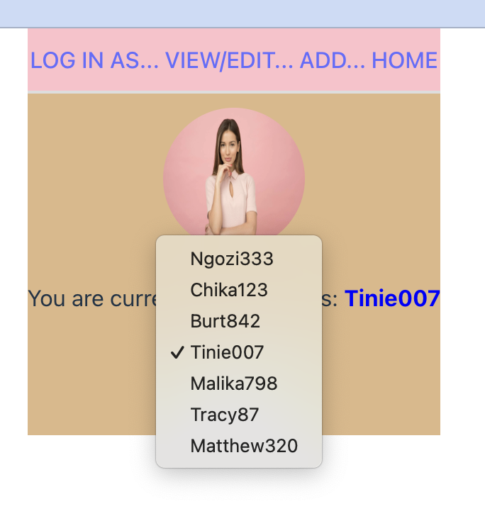
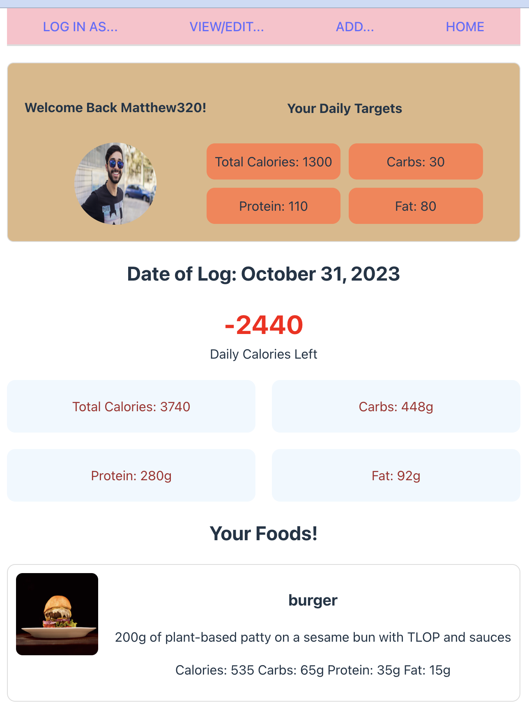
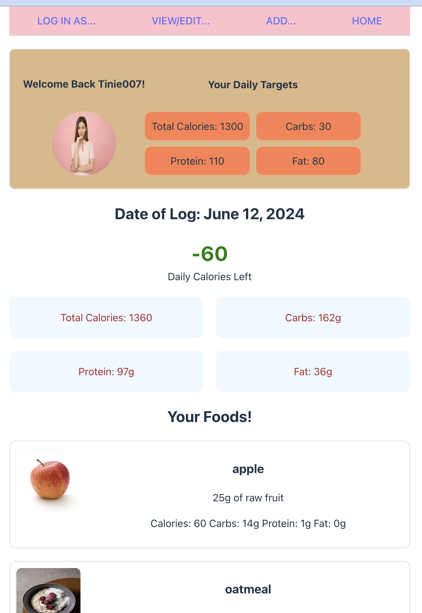

# Calorie Tracker App - My MERN CAPSTONE Project
This project is a full stack app that renders via React on the frontend and utilizes a fully RESTful API on the backend that serves data from a connected cloud-based MongoDB database. I used Express to organize the backend server. the application is designed to help users food journal by logging new journals, accessing old ones, and editing the contents of a journal as needed.

## Table of Contents
- [Installation](#installation)
- [Usage](#usage)
- [Features](#features)
- [Acknowledgements](#acknowledgements)
  
## Installation

##### Live Site
This app is fully deployed on [https://calorietracker-capstone-0rz4.onrender.com](https://calorietracker-capstone-0rz4.onrender.com).

\([Backend](https://calorietracker-capstone.onrender.com)\)

##### Clone the repository
Alternatively, to host locally:

git clone https://github.com/steph2017/318_SBA.git

##### Navigate to the project directory
cd your-repo-name

##### Create your own .env file
include a PORT and MONGO_URL variable with the appropriate values (PORT should be a number like 3000, MONGO_URL should be text starting with "mongodb+srv://" )

##### Run the file
npm start (which will run both backend and frontend as the same time)

if npm start is not working try the following in two separate terminals:
Backend: npm run server:dev
Frontend (navigate to the frontend folder, then): npm run dev

## Features

- Seamless navigation via React Router

- UseEffect is used to populate the Landing Page with the latest added log by the latest added User

- Admin user is able to switch users then be automatically redirected to the Landing Page with Log data responsive to the selected User.

  
- See the presentation video for more!

## Presentation Video
[Capstone Presentation](https://www.loom.com/share/75077e7a40ba4427af3881dcb1f7c2e3)
[Slides](https://www.canva.com/design/DAGNrQ46Vzc/KsTg6Tai-NcL1nSRnQOO9A/view?utm_content=DAGNrQ46Vzc&utm_campaign=designshare&utm_medium=link&utm_source=editor)

## Acknowledgements
This was made possible by:
- Instruction from [Tishana](https://github.com/tishana) and [Manara](https://github.com/Manara-Ali) under the [Per Scholas Software Engineering Immersive]https://perscholas.org/courses/software-engineer/
- I used build scripts by [Manara](https://github.com/Manara-Ali) in order to have both frontend and backend deploy while within one overall project folder.
- Miro for wireframing! [My Board]()